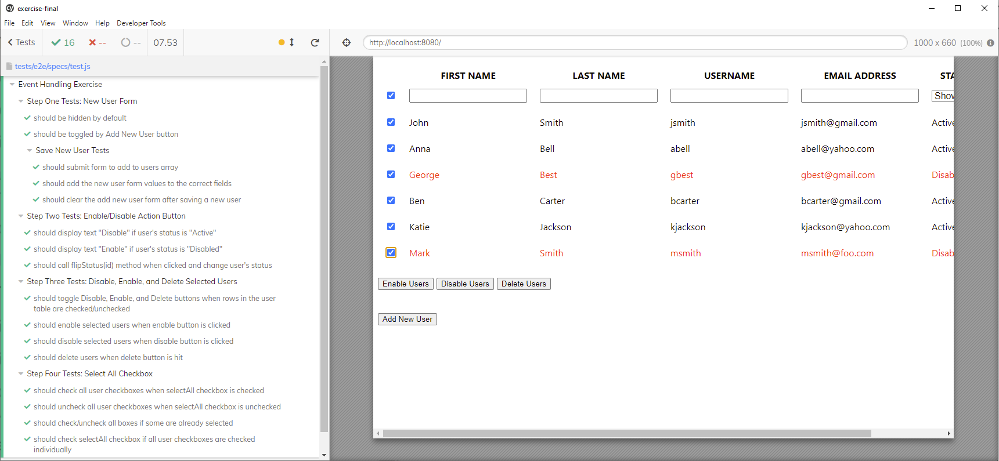

# Vue.js Event Handling Exercise

In this exercise, you'll build on the previous exercise that asked you to display a list of users in a table. First, you'll start by creating a new user form to add users to the list. Second, you'll add the ability to select one or more users and then perform actions on them such as enable, disable, and delete. This is what the final application looks like:

> Before you begin the exercise, run `npm install` to install any dependencies.

## Step One: Add a new user form

The markup for the new user form is already in the template. Complete the following tasks:

- Mark the form as hidden by default.
  - Use a property called `showForm`.
  - Toggle `showForm` with `v-on`.
  - Use `v-show` to show/hide form appropriately.
- Bind each form field to the correct property in the `newUser` object.
- Create a `saveUser` method that adds a new user to the `users` array on the form submission.
  - Get an id for the `newUser` object by calling the `getNextUserId()` method.
  - Clear the form after saving the user.

> After you complete step one, run the end-to-end tests with the following command: `npm run test:e2e`, the tests under "Step One Tests, New User Form" pass.

## Step Two: Add an enable/disable button in action column

In the "Action" column of the table, there's a button that enables or disables the user. Complete the following tasks:

- If the user status = 'Active', the button text displays 'Disable.'
- If the user status = 'Disabled', the button text displays 'Enable.'
- When you click the button, it calls a method `flipStatus()` and change the user's status from 'Active' to 'Disabled', or 'Disabled' to 'Active.'
  - The `flipStatus(id)` method takes the user ID as an argument.
  - You can use the user ID to find the user in the users array and change their status.

> Once you complete this step, the tests under "Step Two Tests, Enable/Disable Action Button" pass.

## Step Three: Disable, enable, and delete selected users

There are three buttons following the user listing table. Complete the following tasks associated with those buttons:

- Add a `selectedUserIDs` property that defaults to an empty array.
- Disable buttons when the `selectedUserIDs` array is empty.
  - Note: use a computed property named `actionButtonDisabled` for this.
- Add the user's ID to the `selectedUserIDs` array when user checks the checkbox.
  - Bind the checked value to if the user's ID is in the `selectedUserIDs` array.
- Enable Users
  - Sets the status of each selected user to `Active`.
  - Clears all checkboxes when action completes.
  - Method name: `enableSelectedUsers()`
- Disable Users
  - Sets the status of each selected user to `Disabled`.
  - Clears all checkboxes when action completes.
  - Method name: `disableSelectedUsers()`
- Delete Users
  - Deletes the user from the `users` array.
  - Clears all checkboxes when action completes.
  - Method name: `deleteSelectedUsers()`

> Tip: Depending how you retrieve the user ID, Vue may give it to you as a string even though it's a number. This may give you issues with comparison—try converting to a number before adding to `selectedUserIDs` if you have comparison issues.

> Once you complete this step, the tests under "Step Three Tests, Disable, Enable, and Delete Selected Users" pass.

## Step Four: Select all checkbox

The "select all" checkbox is the checkbox on the first row with the filter inputs. Complete the following tasks for the "select all" checkbox:

- When clicked to "checked" state, set all boxes to checked and add all users to `selectedUserIDs`. When clicked again to "unchecked" state, set all boxes to unchecked and remove all users from `selectedUserIDs`.
- If some of the boxes are in a checked state, clicking "select all" selects all users. If clicked again, then it deselects all users.
- Check "Select all" when all individual checkboxes get checked.
- Add/remove the user IDs to/from the array depending upon the checked status of all checkboxes.

At this point, all tests pass, as shown here:

